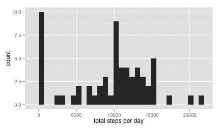
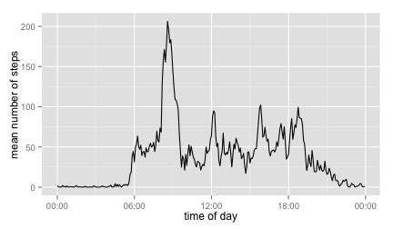
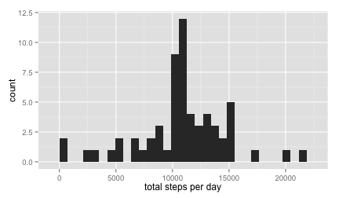
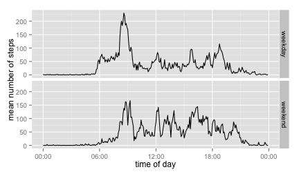

## Loading and preprocessing the data
Load and inspect the data:

```r
if (!file.exists("activity.csv")) unzip("activity.zip")
dat <- read.csv("activity.csv")
str(dat)
```

```
## 'data.frame':	17568 obs. of  3 variables:
##  $ steps   : int  NA NA NA NA NA NA NA NA NA NA ...
##  $ date    : Factor w/ 61 levels "2012-10-01","2012-10-02",..: 1 1 1 1 1 1 1 1 1 1 ...
##  $ interval: int  0 5 10 15 20 25 30 35 40 45 ...
```

The 5-minute time intervals are in numeric format (going like: ...,"50","55","100"). Change this to proper time format ("0:50", "0:55", "1:00") for plotting the time axis without weird jumps:

```r
library(lubridate)
dat$interval <- formatC(dat$interval, width = 4, format = "d", flag = "0")
dat$interval <- parse_date_time(dat$interval, "H!M!")
```


## What is mean total number of steps taken per day?
In order to determine the mean total number of steps for each day, use the `group_by()`
function in the `dplyr` package, and then `summarize()` each day by its total number of steps:

```r
library(dplyr)
dat_by_day <- group_by(dat, date) 
totalsteps <- summarize(dat_by_day, sumSteps=sum(steps, na.rm=TRUE))
```

Then plot the daily totals as a histogram:

```r
library(ggplot2)
ggplot(data=totalsteps) + geom_histogram(aes(x=sumSteps)) +
      xlab("total steps per day")
```

 

We notice that there is a suspiciously large number of days with zero steps. This is possibly due to `NA`'s in the data. The mean and median number of total steps are given by (repectively):

```r
c(mean(totalsteps$sumSteps), median(totalsteps$sumSteps))
```

```
## [1]  9354.23 10395.00
```


## What is the average daily activity pattern?
To analyze the daily activity pattern we group the data by interval, so that we can average the number of steps for a given interval across dates. The mean number of steps for each interval is then plotted to illustrate the activity pattern across as a function of the time of day:

```r
library(scales)
dat_by_interval <- group_by(dat, interval)
meansteps <- summarize(dat_by_interval, msteps=mean(steps, na.rm=TRUE))
ggplot(data=meansteps, aes(x=interval, y=msteps)) +
      geom_line() + scale_x_datetime(labels = date_format("%H:%M")) +
      xlab("time of day") + ylab("mean number of steps")
```

 

The most steps are taken during the 5-minute interval starting at this time of day:

```r
format( meansteps$interval[which.max(meansteps$msteps)] , "%I:%M %p")
```

```
## [1] "08:35 AM"
```


## Imputing missing values
The total number of missing values (NA) in the data set is:

```r
sum(is.na(dat$steps))
```

```
## [1] 2304
```

Replace the missing values by the corresponding mean number of steps for the appropriate time interval:

```r
dat.imputed <- dat
meansteps.alldays <- rep(meansteps$msteps, 61)
dat.imputed[which(is.na(dat$steps)),1] <- meansteps.alldays[which(is.na(dat$steps))]
```

Are there any missing values left?:

```r
sum(is.na(dat.imputed$steps))
```

```
## [1] 0
```

Then again create a histogram depicting the total number of steps for each day. Follow the same method as before, grouping by date:

```r
dat_by_day <- group_by(dat.imputed, date) 
totalsteps <- summarize(dat_by_day, sumSteps=sum(steps))
ggplot(data=totalsteps, aes(x=sumSteps)) + geom_histogram() +
      xlab("total steps per day")
```

 

The mean and median now become (respectively):

```r
c(mean(totalsteps$sumSteps), median(totalsteps$sumSteps))
```

```
## [1] 10766.19 10766.19
```

(Is it odd that the mean and median are _exactly_ the same?) At any rate, after imputing for missing values, the mean and median are now very close to each other.


## Are there differences in activity patterns between weekdays and weekends?
In order to differentiate between weekdays and weekend days, create a separate factor `typeofday` and split the dataframe into two; then proceed as before but do the analysis separately for weekdays and weekend days.


```r
dat.imputed <- mutate(dat.imputed,
                typeofday = ifelse(weekdays(ymd(dat.imputed$date)) %in% 
                                         c("Saturday","Sunday"), "weekend","weekday"))
weekdaydata <- dat.imputed %>% filter(typeofday=="weekday") %>% group_by(interval)
weekdayintervals <- weekdaydata %>%
      summarize(meanSteps=mean(steps)) %>%
      mutate(typeofday="weekday")

weekenddata <- dat.imputed %>% filter(typeofday=="weekend") %>% group_by(interval)
weekendintervals <- weekenddata %>%
      summarize(meanSteps=mean(steps)) %>%
      mutate(typeofday="weekend")
```

Finally put the two resulting data frames back together for plotting.

```r
intervals <- rbind(weekdayintervals, weekendintervals)
ggplot(data=intervals, aes(x=interval, y=meanSteps)) +
      geom_line() + scale_x_datetime(labels = date_format("%H:%M")) +
      facet_grid(typeofday ~ .) +
      xlab("time of day") + ylab("mean number of steps")
```

 

This concludes the assignment.
